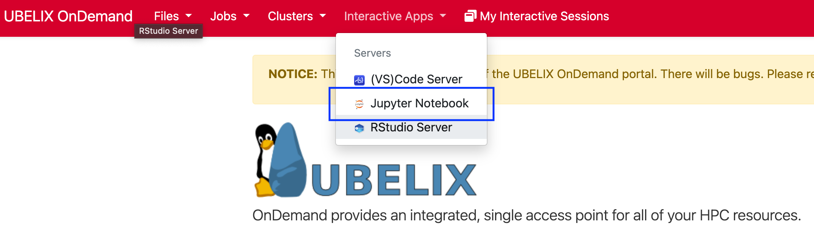
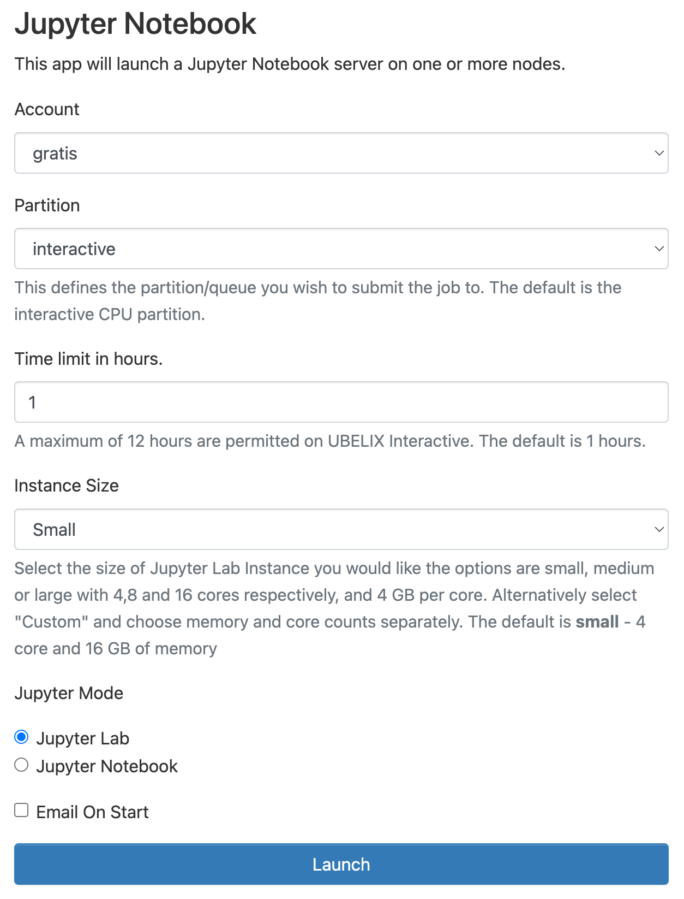
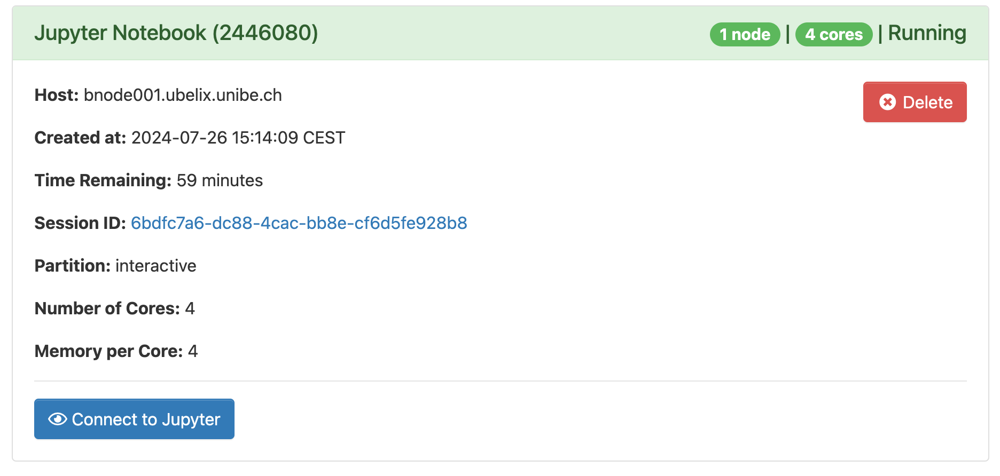

# Jupyter

The Jupyter server allows you to use the start interactive Python editors on UBELIX from your
browser.

1. Select the Jupyter Notebook app under Interactive Apps
       
2. Provide the job specification you want for the Jupyter Server
   
3. Once your server is ready, click `Connect to Jupyter` to access it.
   

!!! warning
    The job may still be running if you close the window or log out. When you are done, shut down Jupyter by clicking `Delete` on the session under My Interactive Sessions. You can confirm that the interactive session has stopped by checking My Interactive Sessions.

## Known limitations

*coming soon*
