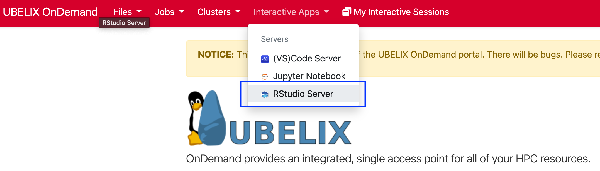
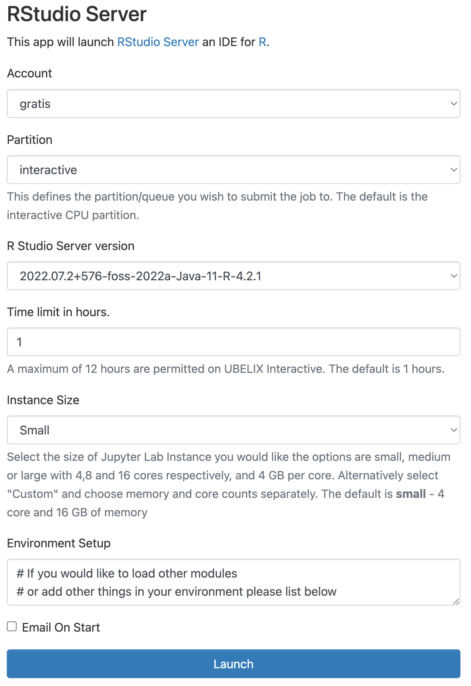

# RStudio

The RStudio server allows you to use RStudio on UBELIX.

1. Select the RStudio Server app under Interactive Apps
   
2. Provide the job specification you want for the RStudio server
   
3. Once RStudio is ready, click `Connect to RStudio Server` to access RStudio.
   

!!! warning
    The job may still be running if you close the window or log out. When you are done, shut down RStudio by clicking `Delete` on the session under My Interactive Sessions. You can confirm that the interactive session has stopped by checking My Interactive Sessions.

## Known limitations

- custom R versions, e.g. from Anaconda are not supported.
  If you have an idea on how to make this happen, get in touch!
- you need to properly stop your R session from within RStudio Server before you exit or you will receive Warnings after the next login
